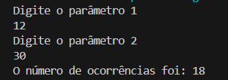
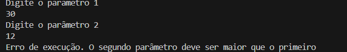

## Controle de Fluxo - Desafio

O sistema recebe dois números inteiros, com estes dois números o programa obtem a quantidade de interações (for) 
e realizar a impressão no console (System.out.print) dos números incrementados;

> Para o programa funcionar corretamente o parâmetro 2 tem que ser maior que o parâmetro 1

Caso o programa funcione corretamente: imagem abaixo

Caso não disparando a exceção: imagem abaixo

